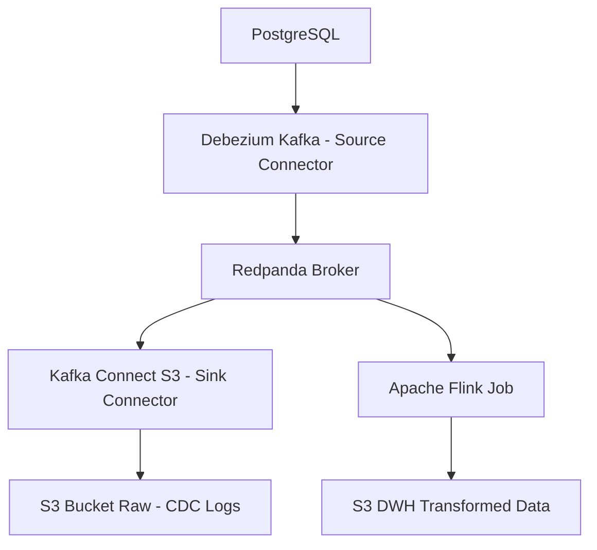

# Data Platform Helm Chart

A modular, environment-aware Helm chart for deploying a CDC and streaming data platform to Kubernetes. Each environment (dev, prod, staging) is isolated in its own namespace, with secrets managed externally for security.

## 📐 Architecture



## 🏗️ Namespace-per-Environment
- Each environment (dev, prod, staging) is deployed into its own Kubernetes namespace.
- Namespace is set via `global.namespace` in the corresponding `values-<env>.yaml` file.
- All resources are scoped to this namespace.

## 🔐 Secret Management
- **Secrets are NOT managed by Helm.**
- Use `scripts/create-secrets.sh <namespace>` to create required secrets in the target namespace:
  - `s3-credentials` (AWS S3 accessKey, secretKey)
  - `postgres-credentials` (host, username, password)
- All charts reference secrets via `.Values.global.xxx.secretName` and use `valueFrom.secretKeyRef` in Deployments.

## 🚀 Usage

### 1. Create Secrets
```bash
cd scripts
./create-secrets.sh data-platform-dev
./create-secrets.sh data-platform-prod
```

### 2. Deploy the Platform
```bash
helm upgrade --install data-platform . -n data-platform-dev --create-namespace -f values-dev.yaml
helm upgrade --install data-platform . -n data-platform-prod --create-namespace -f values-prod.yaml
```

### 3. Validate Connections
(Implement your own checks in `scripts/validate-connections.sh`)

## 📁 Folder Structure

```
data-platform/
├── Chart.yaml
├── values.yaml
├── values-dev.yaml
├── values-prod.yaml
├── templates/
│   ├── _helpers.tpl
│   ├── namespace.yaml
│   └── network-policies.yaml
├── charts/
│   ├── redpanda/
│   ├── debezium/
│   ├── kafka-connect/
│   ├── flink/
│   └── monitoring/
└── scripts/
    ├── create-secrets.sh
    ├── deploy.sh
    └── validate-connections.sh
```

---

- **Do not include secrets in version control.**
- **Do not use external-secrets/ chart.**
- **All secret references use `valueFrom.secretKeyRef`.**

## 🔄 Environment Overrides

Override values per environment by editing `values-dev.yaml`, `values-prod.yaml`, etc. Example:

```yaml
# values-dev.yaml
global:
  s3:
    bucket: dev-bucket
  postgres:
    dbName: devdb
    hostOverride: dev-postgres.example.com
```

## 📦 Helm Dependency Management

If you add or update subcharts, run:

```bash
helm dependency update
```

## 🛡️ Namespace & Network Policy

- Namespace is created dynamically via Helm.
- Basic network policy restricts ingress to internal traffic only.

## 🧪 Testing

- Validate pod status and logs with `scripts/validate-connections.sh`.
- Adjust and extend subcharts as needed for your workloads. 