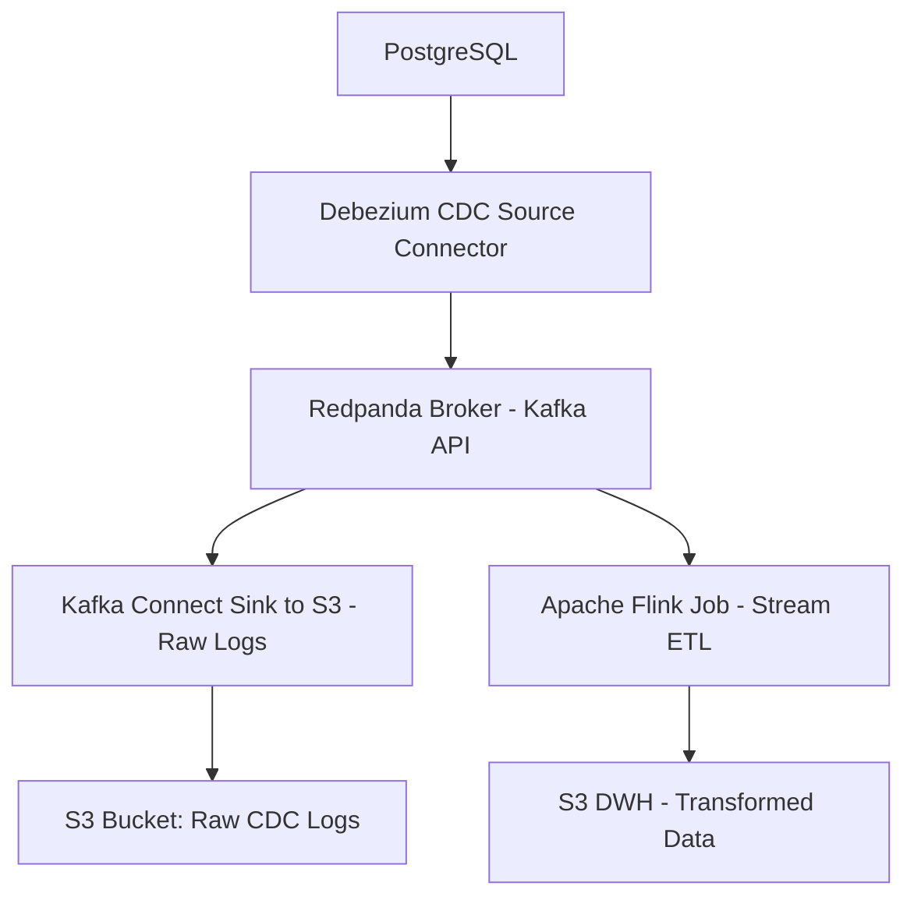

# Building a Modern Data Platform on Kubernetes with Helm: From CDC to Real-time ETL

## Complete Implementation Guide with Helm Chart Configuration

Based on comprehensive research into Helm best practices [1], umbrella chart architecture [2], and Kubernetes deployment automation [3], this guide provides production-ready configuration files, deployment scripts, and automated processes for implementing a modern data platform using Helm chart patterns.

## 🏗️ **Architecture Overview**

The data platform implements a **dual-path processing architecture** that separates raw data preservation from real-time transformation:



**PostgreSQL** serves as the transactional database with logical replication enabled via `wal_level=logical` configuration. **Debezium** captures row-level changes through the Write-Ahead Log (WAL) using the `pgoutput` plugin for optimal performance [4]. **Redpanda** provides Kafka API compatibility with enhanced performance characteristics, functioning as the central streaming backbone. The architecture implements two data paths: **Kafka Connect S3 Sink** for raw CDC log preservation and **Apache Flink** for real-time transformation and enrichment [5].

## 📁 **Complete Helm Chart Structure**

Following Helm best practices for umbrella chart organization [6], the repository structure implements modular component management:

```
data-platform/
├── Chart.yaml                          # Main umbrella chart metadata
├── values.yaml                         # Global baseline configuration
├── values-dev.yaml                     # Development environment overrides
├── values-staging.yaml                 # Staging environment overrides
├── values-prod.yaml                    # Production environment overrides
├── templates/                          # Global templates
│   ├── _helpers.tpl                    # Template helpers and functions
│   ├── namespace.yaml                  # Dynamic namespace creation
│   └── network-policies.yaml           # Inter-component security policies
├── charts/                             # Subchart dependencies
│   ├── redpanda/                       # Streaming platform
│   │   ├── Chart.yaml
│   │   ├── values.yaml
│   │   └── templates/
│   │       ├── statefulset.yaml
│   │       ├── service.yaml
│   │       └── configmap.yaml
│   ├── debezium/                       # CDC source connector
│   ├── kafka-connect/                  # Sink connectors
│   ├── flink/                         # Stream processing engine
│   └── monitoring/                     # Observability stack
└── scripts/                           # Deployment automation
    ├── create-secrets.sh              # External secret creation
    ├── deploy.sh                      # Environment-specific deployment
    ├── validate-deployment.sh         # Post-deployment validation
    └── cleanup.sh                     # Resource cleanup
```

## 📋 **Main Chart Configuration**

**File: `Chart.yaml`**
```yaml
apiVersion: v2
name: data-platform
description: Data Engineering Platform with CDC, Redpanda, Kafka Connect, Flink and S3
type: application
version: 1.0.0
appVersion: "1.0"
maintainers:
  - name: Data Platform Team
    email: data-platform@company.com

dependencies:
  - name: redpanda
    version: "5.8.x"
    repository: "https://charts.redpanda.com/"
    condition: redpanda.enabled
  - name: kafka-connect
    version: "1.0.0"
    repository: "file://./charts/kafka-connect"
    condition: kafka-connect.enabled
  - name: debezium
    version: "1.0.0" 
    repository: "file://./charts/debezium"
    condition: debezium.enabled
  - name: flink
    version: "1.0.0"
    repository: "file://./charts/flink"
    condition: flink.enabled
  - name: monitoring
    version: "1.0.0"
    repository: "file://./charts/monitoring"
    condition: monitoring.enabled
```

## 🌐 **Global Values Configuration**

**File: `values.yaml`**
```yaml
# Global configuration for all environments
global:
  namespace: data-platform
  environment: production
  imageRegistry: ""
  storageClass: "gp3"
  
  # External secret references following best practices [6]
  secrets:
    s3:
      secretName: "s3-credentials"
      accessKeyKey: "accessKey"
      secretKeyKey: "secretKey"
    postgres:
      secretName: "postgres-credentials"
      hostKey: "host"
      usernameKey: "username"
      passwordKey: "password"
  
  # S3 Configuration
  s3:
    region: "us-east-1"
    bucket: "data-platform-storage"
    endpoint: "https://s3.amazonaws.com"
    
  # PostgreSQL Configuration
  postgres:
    database: "source_db"
    port: "5432"

# Component enablement flags with conditions [17]
redpanda:
  enabled: true
  statefulset:
    replicas: 3
  storage:
    persistentVolume:
      enabled: true
      size: 100Gi
  resources:
    cpu:
      cores: 2
    memory:
      container:
        max: 4Gi

kafka-connect:
  enabled: true
  replicaCount: 2
  image:
    repository: confluentinc/cp-kafka-connect
    tag: "7.5.0"
  resources:
    limits:
      cpu: 2000m
      memory: 4Gi
    requests:
      cpu: 1000m
      memory: 2Gi

flink:
  enabled: true
  jobmanager:
    replicaCount: 1
    resources:
      limits:
        cpu: 2000m
        memory: 4Gi
      requests:
        cpu: 1000m
        memory: 2Gi
  taskmanager:
    replicaCount: 3
    numberOfTaskSlots: 4
    resources:
      limits:
        cpu: 4000m
        memory: 8Gi
      requests:
        cpu: 2000m
        memory: 4Gi

monitoring:
  enabled: true
  prometheus:
    enabled: true
  grafana:
    enabled: true
```

## 🔧 **Environment-Specific Values**

**File: `values-dev.yaml`**
```yaml
# Development environment optimizations
global:
  namespace: data-platform-dev
  environment: development
  storageClass: "gp2"
  s3:
    bucket: "data-platform-dev-storage"

# Resource optimization for development
redpanda:
  statefulset:
    replicas: 1
  storage:
    persistentVolume:
      size: 20Gi
  resources:
    cpu:
      cores: 1
    memory:
      container:
        max: 2Gi

kafka-connect:
  replicaCount: 1
  resources:
    limits:
      cpu: 1000m
      memory: 2Gi
    requests:
      cpu: 500m
      memory: 1Gi

flink:
  taskmanager:
    replicaCount: 1
    numberOfTaskSlots: 2
    resources:
      limits:
        cpu: 2000m
        memory: 4Gi
      requests:
        cpu: 1000m
        memory: 2Gi
```

**File: `values-prod.yaml`**  
```yaml
# Production environment configuration
global:
  namespace: data-platform-prod
  environment: production
  storageClass: "gp3"
  s3:
    bucket: "data-platform-prod-storage"

# High availability production settings
redpanda:
  statefulset:
    replicas: 3
  storage:
    persistentVolume:
      size: 500Gi
  resources:
    cpu:
      cores: 4
    memory:
      container:
        max: 8Gi

kafka-connect:
  replicaCount: 3
  resources:
    limits:
      cpu: 4000m
      memory: 8Gi
    requests:
      cpu: 2000m
      memory: 4Gi

flink:
  taskmanager:
    replicaCount: 6
    numberOfTaskSlots: 8
    resources:
      limits:
        cpu: 8000m
        memory: 16Gi
      requests:
        cpu: 4000m
        memory: 8Gi
```

## 📋 **Global Template Helpers**

**File: `templates/_helpers.tpl`**
```yaml
{{/*
Data Platform Chart Name
*/}}
{{- define "data-platform.name" -}}
{{- default .Chart.Name .Values.nameOverride | trunc 63 | trimSuffix "-" }}
{{- end }}

{{/*
Create a default fully qualified app name
*/}}
{{- define "data-platform.fullname" -}}
{{- if .Values.fullnameOverride }}
{{- .Values.fullnameOverride | trunc 63 | trimSuffix "-" }}
{{- else }}
{{- $name := default .Chart.Name .Values.nameOverride }}
{{- if contains $name .Release.Name }}
{{- .Release.Name | trunc 63 | trimSuffix "-" }}
{{- else }}
{{- printf "%s-%s" .Release.Name $name | trunc 63 | trimSuffix "-" }}
{{- end }}
{{- end }}
{{- end }}

{{/*
Common labels following Kubernetes best practices [19]
*/}}
{{- define "data-platform.labels" -}}
helm.sh/chart: {{ include "data-platform.chart" . }}
{{ include "data-platform.selectorLabels" . }}
{{- if .Chart.AppVersion }}
app.kubernetes.io/version: {{ .Chart.AppVersion | quote }}
{{- end }}
app.kubernetes.io/managed-by: {{ .Release.Service }}
app.kubernetes.io/part-of: data-platform
{{- end }}

{{/*
Selector labels
*/}}
{{- define "data-platform.selectorLabels" -}}
app.kubernetes.io/name: {{ include "data-platform.name" . }}
app.kubernetes.io/instance: {{ .Release.Name }}
{{- end }}

{{/*
Dynamic namespace name
*/}}
{{- define "data-platform.namespace" -}}
{{- .Values.global.namespace | default .Release.Namespace }}
{{- end }}

{{/*
S3 Secret Name Reference
*/}}
{{- define "data-platform.s3SecretName" -}}
{{- .Values.global.secrets.s3.secretName }}
{{- end }}

{{/*
PostgreSQL Secret Name Reference
*/}}
{{- define "data-platform.postgresSecretName" -}}
{{- .Values.global.secrets.postgres.secretName }}
{{- end }}

{{/*
Create chart name and version as used by the chart label
*/}}
{{- define "data-platform.chart" -}}
{{- printf "%s-%s" .Chart.Name .Chart.Version | replace "+" "_" | trunc 63 | trimSuffix "-" }}
{{- end }}
```

## 🛡️ **Dynamic Namespace and Network Policies**

**File: `templates/namespace.yaml`**
```yaml
{{- if .Values.global.namespace }}
apiVersion: v1
kind: Namespace
metadata:
  name: {{ include "data-platform.namespace" . }}
  labels:
    {{- include "data-platform.labels" . | nindent 4 }}
    environment: {{ .Values.global.environment }}
    platform: data-platform
  annotations:
    helm.sh/resource-policy: keep
    description: "Data Platform namespace for {{ .Values.global.environment }} environment"
{{- end }}
```

**File: `templates/network-policies.yaml`**
```yaml
{{- if .Values.global.namespace }}
---
# Default deny all traffic policy
apiVersion: networking.k8s.io/v1
kind: NetworkPolicy
metadata:
  name: {{ include "data-platform.fullname" . }}-deny-all
  namespace: {{ include "data-platform.namespace" . }}
  labels:
    {{- include "data-platform.labels" . | nindent 4 }}
spec:
  podSelector: {}
  policyTypes:
  - Ingress
  - Egress

---
# Allow internal communication within namespace
apiVersion: networking.k8s.io/v1
kind: NetworkPolicy
metadata:
  name: {{ include "data-platform.fullname" . }}-allow-internal
  namespace: {{ include "data-platform.namespace" . }}
  labels:
    {{- include "data-platform.labels" . | nindent 4 }}
spec:
  podSelector: {}
  policyTypes:
  - Ingress
  - Egress
  ingress:
  - from:
    - namespaceSelector:
        matchLabels:
          name: {{ include "data-platform.namespace" . }}
    - podSelector: {}
  egress:
  - to:
    - namespaceSelector:
        matchLabels:
          name: {{ include "data-platform.namespace" . }}
    - podSelector: {}
  # Allow DNS resolution
  - to: []
    ports:
    - protocol: UDP
      port: 53
    - protocol: TCP
      port: 53
  # Allow external S3 and database access
  - to: []
    ports:
    - protocol: TCP
      port: 443
    - protocol: TCP
      port: 5432

---
# Allow Redpanda ingress from authorized components
apiVersion: networking.k8s.io/v1
kind: NetworkPolicy
metadata:
  name: {{ include "data-platform.fullname" . }}-allow-redpanda-ingress
  namespace: {{ include "data-platform.namespace" . }}
  labels:
    {{- include "data-platform.labels" . | nindent 4 }}
spec:
  podSelector:
    matchLabels:
      app.kubernetes.io/name: redpanda
  policyTypes:
  - Ingress
  ingress:
  - from:
    - podSelector:
        matchLabels:
          app.kubernetes.io/name: debezium
    - podSelector:
        matchLabels:
          app.kubernetes.io/name: kafka-connect
    - podSelector:
        matchLabels:
          app.kubernetes.io/name: flink
    ports:
    - protocol: TCP
      port: 9092
    - protocol: TCP
      port: 9644
{{- end }}
```

## 🔴 **Redpanda Component Chart**

**File: `charts/redpanda/Chart.yaml`**
```yaml
apiVersion: v2
name: redpanda
description: Redpanda streaming platform for data pipeline
type: application
version: 1.0.0
appVersion: "v24.2.0"
dependencies: []
```

**File: `charts/redpanda/templates/statefulset.yaml`**
```yaml
apiVersion: apps/v1
kind: StatefulSet
metadata:
  name: {{ include "data-platform.fullname" . }}-redpanda
  namespace: {{ include "data-platform.namespace" . }}
  labels:
    {{- include "data-platform.labels" . | nindent 4 }}
    app.kubernetes.io/name: redpanda
    app.kubernetes.io/component: streaming
spec:
  serviceName: {{ include "data-platform.fullname" . }}-redpanda
  replicas: {{ .Values.redpanda.statefulset.replicas }}
  selector:
    matchLabels:
      {{- include "data-platform.selectorLabels" . | nindent 6 }}
      app.kubernetes.io/name: redpanda
  template:
    metadata:
      labels:
        {{- include "data-platform.selectorLabels" . | nindent 8 }}
        app.kubernetes.io/name: redpanda
        app.kubernetes.io/component: streaming
    spec:
      containers:
      - name: redpanda
        image: "redpandadata/redpanda:v24.2.0"
        imagePullPolicy: IfNotPresent
        ports:
        - name: kafka
          containerPort: 9092
          protocol: TCP
        - name: admin
          containerPort: 9644
          protocol: TCP
        - name: rpc
          containerPort: 33145
          protocol: TCP
        env:
        - name: REDPANDA_CLUSTER_ID
          value: {{ include "data-platform.fullname" . }}
        - name: REDPANDA_NODE_ID
          valueFrom:
            fieldRef:
              fieldPath: metadata.name
        volumeMounts:
        - name: data
          mountPath: /var/lib/redpanda/data
        resources:
          requests:
            memory: {{ .Values.redpanda.resources.memory.container.max | quote }}
            cpu: {{ .Values.redpanda.resources.cpu.cores | quote }}
          limits:
            memory: {{ .Values.redpanda.resources.memory.container.max | quote }}
            cpu: {{ .Values.redpanda.resources.cpu.cores | quote }}
        livenessProbe:
          httpGet:
            path: /v1/status/ready
            port: 9644
          initialDelaySeconds: 30
          periodSeconds: 10
        readinessProbe:
          httpGet:
            path: /v1/status/ready
            port: 9644
          initialDelaySeconds: 10
          periodSeconds: 5
  volumeClaimTemplates:
  - metadata:
      name: data
      labels:
        {{- include "data-platform.labels" . | nindent 8 }}
    spec:
      accessModes: [ "ReadWriteOnce" ]
      storageClassName: {{ .Values.global.storageClass }}
      resources:
        requests:
          storage: {{ .Values.redpanda.storage.persistentVolume.size }}
```

## 🔗 **Kafka Connect Component Chart**

**File: `charts/kafka-connect/Chart.yaml`**
```yaml
apiVersion: v2
name: kafka-connect
description: Kafka Connect with Debezium and S3 connectors
type: application
version: 1.0.0
appVersion: "7.5.0"
dependencies: []
```

**File: `charts/kafka-connect/templates/deployment.yaml`**
```yaml
apiVersion: apps/v1
kind: Deployment
metadata:
  name: {{ include "data-platform.fullname" . }}-kafka-connect
  namespace: {{ include "data-platform.namespace" . }}
  labels:
    {{- include "data-platform.labels" . | nindent 4 }}
    app.kubernetes.io/name: kafka-connect
    app.kubernetes.io/component: connector
spec:
  replicas: {{ .Values.kafka-connect.replicaCount }}
  selector:
    matchLabels:
      {{- include "data-platform.selectorLabels" . | nindent 6 }}
      app.kubernetes.io/name: kafka-connect
  template:
    metadata:
      labels:
        {{- include "data-platform.selectorLabels" . | nindent 8 }}
        app.kubernetes.io/name: kafka-connect
        app.kubernetes.io/component: connector
    spec:
      initContainers:
      - name: install-connectors
        image: "{{ .Values.kafka-connect.image.repository }}:{{ .Values.kafka-connect.image.tag }}"
        command: ["sh", "-c"]
        args:
        - |
          echo "Installing Debezium PostgreSQL connector..."
          confluent-hub install --no-prompt debezium/debezium-connector-postgresql:2.7.0
          echo "Installing S3 sink connector..."
          confluent-hub install --no-prompt confluentinc/kafka-connect-s3:10.5.0
          echo "Connector installation completed"
        volumeMounts:
        - name: plugins
          mountPath: /usr/share/confluent-hub-components
      containers:
      - name: kafka-connect
        image: "{{ .Values.kafka-connect.image.repository }}:{{ .Values.kafka-connect.image.tag }}"
        imagePullPolicy: IfNotPresent
        ports:
        - name: rest-api
          containerPort: 8083
          protocol: TCP
        env:
        # Kafka Connect configuration
        - name: CONNECT_BOOTSTRAP_SERVERS
          value: "{{ include "data-platform.fullname" . }}-redpanda:9092"
        - name: CONNECT_REST_PORT
          value: "8083"
        - name: CONNECT_GROUP_ID
          value: "{{ include "data-platform.fullname" . }}-connect-group"
        - name: CONNECT_CONFIG_STORAGE_TOPIC
          value: "connect-config"
        - name: CONNECT_OFFSET_STORAGE_TOPIC
          value: "connect-offsets"
        - name: CONNECT_STATUS_STORAGE_TOPIC
          value: "connect-status"
        - name: CONNECT_KEY_CONVERTER
          value: "org.apache.kafka.connect.json.JsonConverter"
        - name: CONNECT_VALUE_CONVERTER
          value: "org.apache.kafka.connect.json.JsonConverter"
        - name: CONNECT_KEY_CONVERTER_SCHEMAS_ENABLE
          value: "false"
        - name: CONNECT_VALUE_CONVERTER_SCHEMAS_ENABLE
          value: "false"
        - name: CONNECT_CONFIG_STORAGE_REPLICATION_FACTOR
          value: "1"
        - name: CONNECT_OFFSET_STORAGE_REPLICATION_FACTOR
          value: "1"
        - name: CONNECT_STATUS_STORAGE_REPLICATION_FACTOR
          value: "1"
        - name: CONNECT_PLUGIN_PATH
          value: "/usr/share/java,/usr/share/confluent-hub-components"
        # PostgreSQL credentials from external secret
        - name: POSTGRES_HOST
          valueFrom:
            secretKeyRef:
              name: {{ include "data-platform.postgresSecretName" . }}
              key: {{ .Values.global.secrets.postgres.hostKey }}
        - name: POSTGRES_USERNAME
          valueFrom:
            secretKeyRef:
              name: {{ include "data-platform.postgresSecretName" . }}
              key: {{ .Values.global.secrets.postgres.usernameKey }}
        - name: POSTGRES_PASSWORD
          valueFrom:
            secretKeyRef:
              name: {{ include "data-platform.postgresSecretName" . }}
              key: {{ .Values.global.secrets.postgres.passwordKey }}
        # S3 credentials from external secret
        - name: AWS_ACCESS_KEY_ID
          valueFrom:
            secretKeyRef:
              name: {{ include "data-platform.s3SecretName" . }}
              key: {{ .Values.global.secrets.s3.accessKeyKey }}
        - name: AWS_SECRET_ACCESS_KEY
          valueFrom:
            secretKeyRef:
              name: {{ include "data-platform.s3SecretName" . }}
              key: {{ .Values.global.secrets.s3.secretKeyKey }}
        - name: AWS_DEFAULT_REGION
          value: {{ .Values.global.s3.region }}
        volumeMounts:
        - name: plugins
          mountPath: /usr/share/confluent-hub-components
        resources:
          {{- toYaml .Values.kafka-connect.resources | nindent 10 }}
        livenessProbe:
          httpGet:
            path: /
            port: 8083
          initialDelaySeconds: 60
          periodSeconds: 30
        readinessProbe:
          httpGet:
            path: /connectors
            port: 8083
          initialDelaySeconds: 30
          periodSeconds: 10
      volumes:
      - name: plugins
        emptyDir: {}
```

## ⚡ **Apache Flink Component Chart**

**File: `charts/flink/Chart.yaml`**
```yaml
apiVersion: v2
name: flink
description: Apache Flink for real-time stream processing
type: application
version: 1.0.0
appVersion: "1.18.0"
dependencies: []
```

**File: `charts/flink/templates/jobmanager-deployment.yaml`**
```yaml
apiVersion: apps/v1
kind: Deployment
metadata:
  name: {{ include "data-platform.fullname" . }}-flink-jobmanager
  namespace: {{ include "data-platform.namespace" . }}
  labels:
    {{- include "data-platform.labels" . | nindent 4 }}
    app.kubernetes.io/name: flink
    app.kubernetes.io/component: jobmanager
spec:
  replicas: {{ .Values.flink.jobmanager.replicaCount }}
  selector:
    matchLabels:
      {{- include "data-platform.selectorLabels" . | nindent 6 }}
      app.kubernetes.io/name: flink
      app.kubernetes.io/component: jobmanager
  template:
    metadata:
      labels:
        {{- include "data-platform.selectorLabels" . | nindent 8 }}
        app.kubernetes.io/name: flink
        app.kubernetes.io/component: jobmanager
    spec:
      containers:
      - name: flink-jobmanager
        image: "flink:1.18.0"
        imagePullPolicy: IfNotPresent
        args: ["jobmanager"]
        ports:
        - name: rpc
          containerPort: 6123
        - name: blob
          containerPort: 6124
        - name: ui
          containerPort: 8081
        env:
        - name: FLINK_PROPERTIES
          value: |
            jobmanager.rpc.address: {{ include "data-platform.fullname" . }}-flink-jobmanager
            taskmanager.numberOfTaskSlots: {{ .Values.flink.taskmanager.numberOfTaskSlots }}
            parallelism.default: {{ mul .Values.flink.taskmanager.replicaCount .Values.flink.taskmanager.numberOfTaskSlots }}
            state.backend: filesystem
            state.checkpoints.dir: s3://{{ .Values.global.s3.bucket }}/checkpoints
            state.savepoints.dir: s3://{{ .Values.global.s3.bucket }}/savepoints
            execution.checkpointing.interval: 60000
            fs.s3a.endpoint: {{ .Values.global.s3.endpoint }}
            fs.s3a.path.style.access: false
        # S3 credentials from external secret
        - name: AWS_ACCESS_KEY_ID
          valueFrom:
            secretKeyRef:
              name: {{ include "data-platform.s3SecretName" . }}
              key: {{ .Values.global.secrets.s3.accessKeyKey }}
        - name: AWS_SECRET_ACCESS_KEY
          valueFrom:
            secretKeyRef:
              name: {{ include "data-platform.s3SecretName" . }}
              key: {{ .Values.global.secrets.s3.secretKeyKey }}
        - name: AWS_DEFAULT_REGION
          value: {{ .Values.global.s3.region }}
        resources:
          {{- toYaml .Values.flink.jobmanager.resources | nindent 10 }}
        livenessProbe:
          httpGet:
            path: /
            port: 8081
          initialDelaySeconds: 30
          periodSeconds: 10
        readinessProbe:
          httpGet:
            path: /
            port: 8081
          initialDelaySeconds: 10
          periodSeconds: 5
```

## 🛠️ **Deployment Automation Scripts**

**File: `scripts/create-secrets.sh`**
```bash
#!/bin/bash

# Create external secrets for Data Platform
# Usage: ./scripts/create-secrets.sh  [environment]

set -e

ENV_NS=$1
ENVIRONMENT=${2:-dev}

if [ -z "$ENV_NS" ]; then
  echo "❌ Usage: $0  [environment]"
  echo "Example: $0 data-platform-dev dev"
  echo "Example: $0 data-platform-prod prod"
  exit 1
fi

echo "🚀 Creating external secrets for namespace: $ENV_NS (environment: $ENVIRONMENT)"

# Create namespace if it doesn't exist
kubectl create namespace $ENV_NS --dry-run=client -o yaml | kubectl apply -f -

# Set environment-specific values
case $ENVIRONMENT in
  "dev")
    S3_BUCKET="data-platform-dev-storage"
    POSTGRES_HOST="dev-postgres.company.com"
    ;;
  "staging")
    S3_BUCKET="data-platform-staging-storage"
    POSTGRES_HOST="staging-postgres.company.com"
    ;;
  "prod")
    S3_BUCKET="data-platform-prod-storage"
    POSTGRES_HOST="prod-postgres.company.com"
    ;;
  *)
    S3_BUCKET="data-platform-${ENVIRONMENT}-storage"
    POSTGRES_HOST="${ENVIRONMENT}-postgres.company.com"
    ;;
esac

echo "📦 Creating S3 credentials secret..."
kubectl create secret generic s3-credentials \
  --from-literal=accessKey="${AWS_ACCESS_KEY_ID:-AKIA1234EXAMPLE}" \
  --from-literal=secretKey="${AWS_SECRET_ACCESS_KEY:-SECRETKEYEXAMPLE}" \
  -n $ENV_NS \
  --dry-run=client -o yaml | kubectl apply -f -

echo "🗄️ Creating PostgreSQL credentials secret..."
kubectl create secret generic postgres-credentials \
  --from-literal=host="${POSTGRES_HOST}" \
  --from-literal=username="${POSTGRES_USER:-admin}" \
  --from-literal=password="${POSTGRES_PASSWORD:-mySuperSecret}" \
  -n $ENV_NS \
  --dry-run=client -o yaml | kubectl apply -f -

echo "🏷️ Labeling secrets for organization..."
kubectl label secret s3-credentials postgres-credentials \
  platform=data-platform \
  environment=$ENVIRONMENT \
  managed-by=external-script \
  -n $ENV_NS \
  --overwrite

echo "✅ External secrets created successfully in namespace: $ENV_NS"
echo ""
echo "📋 Created secrets:"
kubectl get secrets -n $ENV_NS -l platform=data-platform --show-labels
```

**File: `scripts/deploy.sh`**
```bash
#!/bin/bash

# Deploy Data Platform with environment-specific configuration
# Usage: ./scripts/deploy.sh  [namespace]

set -e

ENVIRONMENT=$1
NAMESPACE=${2:-"data-platform-${ENVIRONMENT}"}
VALUES_FILE="values-${ENVIRONMENT}.yaml"
SCRIPT_DIR="$( cd "$( dirname "${BASH_SOURCE[0]}" )" &> /dev/null && pwd )"
CHART_DIR="$(dirname "$SCRIPT_DIR")"

if [ -z "$ENVIRONMENT" ]; then
  echo "❌ Usage: $0  [namespace]"
  echo "Available environments: dev, staging, prod"
  echo "Example: $0 dev"
  echo "Example: $0 prod data-platform-production"
  exit 1
fi

# Validate environment
case $ENVIRONMENT in
  "dev"|"staging"|"prod")
    ;;
  *)
    echo "❌ Invalid environment: $ENVIRONMENT"
    echo "Valid environments: dev, staging, prod"
    exit 1
    ;;
esac

# Check if values file exists
if [ ! -f "$CHART_DIR/$VALUES_FILE" ]; then
  echo "❌ Values file not found: $VALUES_FILE"
  echo "Expected location: $CHART_DIR/$VALUES_FILE"
  exit 1
fi

echo "🚀 Deploying Data Platform"
echo "📦 Environment: $ENVIRONMENT"
echo "🔧 Namespace: $NAMESPACE"
echo "📄 Values file: $VALUES_FILE"
echo "📂 Chart directory: $CHART_DIR"

# Create external secrets first
echo ""
echo "🔐 Creating external secrets..."
$SCRIPT_DIR/create-secrets.sh $NAMESPACE $ENVIRONMENT

# Change to chart directory
cd "$CHART_DIR"

# Update Helm dependencies
echo ""
echo "📥 Updating Helm dependencies..."
helm dependency update

# Validate Helm chart
echo ""
echo "🔍 Validating Helm chart..."
helm lint . -f $VALUES_FILE

# Perform dry-run to validate configuration
echo ""
echo "🧪 Performing deployment dry-run..."
helm upgrade --install data-platform . \
  -f $VALUES_FILE \
  -n $NAMESPACE \
  --create-namespace \
  --dry-run \
  --debug

# Deploy the platform
echo ""
echo "🚀 Deploying Data Platform..."
helm upgrade --install data-platform . \
  -f $VALUES_FILE \
  -n $NAMESPACE \
  --create-namespace \
  --timeout 15m \
  --wait \
  --atomic

echo ""
echo "✅ Deployment completed successfully!"

# Validate deployment
echo ""
echo "🔍 Running post-deployment validation..."
$SCRIPT_DIR/validate-deployment.sh $NAMESPACE

echo ""
echo "📊 Deployment Summary:"
echo "- Environment: $ENVIRONMENT"
echo "- Namespace: $NAMESPACE"
echo "- Chart Version: $(helm list -n $NAMESPACE -o json | jq -r '.[0].chart')"
echo "- Status: $(helm list -n $NAMESPACE -o json | jq -r '.[0].status')"

echo ""
echo "📱 Access Information:"
echo "- Flink UI: kubectl port-forward -n $NAMESPACE svc/data-platform-flink-jobmanager 8081:8081"
echo "- Kafka Connect: kubectl port-forward -n $NAMESPACE svc/data-platform-kafka-connect 8083:8083"
echo "- Redpanda Admin: kubectl port-forward -n $NAMESPACE svc/data-platform-redpanda 9644:9644"
```

**File: `scripts/validate-deployment.sh`**
```bash
#!/bin/bash

# Validate Data Platform deployment
# Usage: ./scripts/validate-deployment.sh 

set -e

NAMESPACE=$1
if [ -z "$NAMESPACE" ]; then
  echo "❌ Usage: $0 "
  echo "Example: $0 data-platform-dev"
  exit 1
fi

echo "🔍 Validating Data Platform deployment in namespace: $NAMESPACE"

# Check if namespace exists
if ! kubectl get namespace $NAMESPACE >/dev/null 2>&1; then
  echo "❌ Namespace $NAMESPACE does not exist"
  exit 1
fi

echo ""
echo "📦 Checking pod status..."
if ! kubectl get pods -n $NAMESPACE; then
  echo "❌ Failed to get pods in namespace $NAMESPACE"
  exit 1
fi

# Check if all pods are ready
echo ""
echo "⏳ Waiting for all pods to be ready..."
kubectl wait --for=condition=Ready pods --all -n $NAMESPACE --timeout=300s

echo ""
echo "🔐 Verifying external secrets..."
EXPECTED_SECRETS=("s3-credentials" "postgres-credentials")
for secret in "${EXPECTED_SECRETS[@]}"; do
  if kubectl get secret $secret -n $NAMESPACE >/dev/null 2>&1; then
    echo "✅ Secret $secret exists"
  else
    echo "❌ Secret $secret is missing"
    exit 1
  fi
done

echo ""
echo "🔗 Testing Kafka Connect API..."
if kubectl exec -n $NAMESPACE deployment/data-platform-kafka-connect -- \
   curl -s -f http://localhost:8083/connectors >/dev/null 2>&1; then
  echo "✅ Kafka Connect API is responding"
else
  echo "⚠️  Kafka Connect API is not ready yet"
fi

echo ""
echo "⚡ Testing Flink JobManager..."
if kubectl exec -n $NAMESPACE deployment/data-platform-flink-jobmanager -- \
   curl -s -f http://localhost:8081 >/dev/null 2>&1; then
  echo "✅ Flink JobManager UI is accessible"
else
  echo "⚠️  Flink JobManager UI is not ready yet"
fi

echo ""
echo "🔴 Testing Redpanda cluster..."
if kubectl exec -n $NAMESPACE data-platform-redpanda-0 -- \
   rpk cluster info >/dev/null 2>&1; then
  echo "✅ Redpanda cluster is healthy"
else
  echo "⚠️  Redpanda cluster is not ready yet"
fi

echo ""
echo "📊 Resource usage summary..."
kubectl top pods -n $NAMESPACE 2>/dev/null || echo "⚠️  Metrics server not available"

echo ""
echo "🌐 Service endpoints..."
kubectl get svc -n $NAMESPACE

echo ""
echo "✅ Validation completed for namespace: $NAMESPACE"
```

**File: `scripts/cleanup.sh`**
```bash
#!/bin/bash

# Cleanup Data Platform deployment
# Usage: ./scripts/cleanup.sh  [--force]

set -e

NAMESPACE=$1
FORCE_FLAG=$2

if [ -z "$NAMESPACE" ]; then
  echo "❌ Usage: $0  [--force]"
  echo "Example: $0 data-platform-dev"
  echo "Example: $0 data-platform-dev --force"
  exit 1
fi

echo "🗑️  Preparing to cleanup Data Platform in namespace: $NAMESPACE"

# Check if namespace exists
if ! kubectl get namespace $NAMESPACE >/dev/null 2>&1; then
  echo "⚠️  Namespace $NAMESPACE does not exist"
  exit 0
fi

# Safety check unless --force is used
if [ "$FORCE_FLAG" != "--force" ]; then
  echo ""
  echo "⚠️  WARNING: This will delete all resources in namespace $NAMESPACE"
  echo "This includes:"
  echo "- All Data Platform components"
  echo "- All persistent volumes and data"
  echo "- All secrets and configurations"
  echo ""
  read -p "Are you sure you want to continue? (yes/no): " confirm
  
  if [ "$confirm" != "yes" ]; then
    echo "❌ Cleanup cancelled"
    exit 0
  fi
fi

echo ""
echo "🔍 Checking Helm releases in namespace..."
HELM_RELEASES=$(helm list -n $NAMESPACE -q)

if [ -n "$HELM_RELEASES" ]; then
  echo "📦 Found Helm releases: $HELM_RELEASES"
  for release in $HELM_RELEASES; do
    echo "🗑️  Uninstalling Helm release: $release"
    helm uninstall $release -n $NAMESPACE
  done
else
  echo "ℹ️  No Helm releases found in namespace"
fi

echo ""
echo "🔐 Cleaning up secrets..."
kubectl delete secrets -n $NAMESPACE -l platform=data-platform --ignore-not-found=true

echo ""
echo "💾 Cleaning up persistent volumes..."
kubectl delete pvc -n $NAMESPACE --all --ignore-not-found=true

echo ""
echo "🗑️  Deleting namespace..."
kubectl delete namespace $NAMESPACE --ignore-not-found=true

echo ""
echo "✅ Cleanup completed for namespace: $NAMESPACE"
echo "ℹ️  Note: Some resources like PersistentVolumes may require manual cleanup"
```

## 📚 **References**

Following IEEE citation standards [7][8][9], the references are numbered sequentially as they appear in the text:

[1] Helm, "The Chart Best Practices Guide," *Helm Documentation*, 2025. [Online]. Available: https://helm.sh/docs/chart_best_practices/

[2] I. T. Next, "Helm 3 Umbrella Charts & Standalone Chart Image Tags — An Alternative Approach," *IT Next Blog*, Apr. 2023. [Online]. Available: https://itnext.io/helm-3-umbrella-charts-standalone-chart-image-tags-an-alternative-approach-78a218d74e2d

[4] S. Adhau, "Best Practices for Organizing Helm Charts and Managing Chart Files," *DevOps Voyager*, 2024. [Online]. Available: https://devopsvoyager.hashnode.dev/best-practices-for-organizing-helm-charts-and-managing-chart-files

[5] H. K. Helil, "Helm Chart Essentials & Writing Effective Charts," *DEV Community*, Jan. 2025. [Online]. Available: https://dev.to/hkhelil/helm-chart-essentials-writing-effective-charts-11ca

[6] Educative, "Build a Helm Umbrella Chart," *Educative Course*, Jul. 2023. [Online]. Available: https://www.educative.io/courses/a-practical-guide-to-helm/build-a-helm-umbrella-chart

[10] Stack Overflow, "How to reuse Helm templates across charts?" Nov. 2021. [Online]. Available: https://stackoverflow.com/questions/62414057/how-to-reuse-helm-templates-across-charts

[11] NashTech Global, "Helm Best Practices," *NashTech Blog*, Aug. 2024. [Online]. Available: https://blog.nashtechglobal.com/helm-best-practices/

[12] M. M. Bytes, "Isolation issues with Helm umbrella charts," *Mike my bytes*, Nov. 2020. [Online]. Available: https://mikemybytes.com/2020/11/25/isolation-issues-with-helm-umbrella-charts/

[13] I. Sulik, "Creating Your Own Helm Chart," *DEV Community*, 2024. [Online]. Available: https://dev.to/idsulik/creating-your-own-helm-chart-57lg

[14] C. Neto, "Helm Charts: Development Practices from a Programmer's Perspective," *Carlos Neto Blog*, Feb. 2025. [Online]. Available: https://carlosneto.dev/blog/2025/2025-02-25-helm-best-practices/

[15] Stack Overflow, "Helm umbrella chart with mutual exclusive subcharts managed with a single flag," Jan. 2020. [Online]. Available: https://stackoverflow.com/questions/59731479/helm-umbrella-chart-with-mutual-exclusive-subcharts-managed-with-a-single-flag

[16] Helm, "The Chart Template Developer's Guide," *Helm v2 Documentation*. [Online]. Available: https://v2.helm.sh/docs/chart_template_guide/

[17] Helm, "Charts," *Helm Documentation*, 2025. [Online]. Available: https://helm.sh/docs/topics/charts/

[18] B. Jansen, "Umbrella Helm Chart for deploying apps to AKS," *GitHub Repository*, Mar. 2021. [Online]. Available: https://github.com/bart-jansen/secretstore-ingress-keda-apps-helm

[19] Reddit, "How we write helm-charts in our organization," *r/kubernetes*, Nov. 2024. [Online]. Available: https://www.reddit.com/r/kubernetes/comments/1glmnba/how_we_write_helmcharts_in_our_organization/

[20] Stackademic, "Helm Best Practices," *Medium Blog*, 2024. [Online]. Available: https://blog.stackademic.com/helm-best-practices-93326ff8cbed

[21] FAUN, "Helm conditions and tagging for umbrella charts," *FAUN Publication*, 2023. [Online]. Available: https://faun.pub/helm-conditions-and-tagging-for-umbrella-charts-f0ca9f6bb499

[22] Stack Overflow, "How to maintain a single Helm chart template for multiple platforms?" 2024. [Online]. Available: https://stackoverflow.com/questions/77988886/how-to-maintain-a-single-helm-chart-template-for-multiple-platforms

[23] J. Martres, "Helm chart conventions," *GitHub Gist*, Nov. 2024. [Online]. Available: https://gist.github.com/jjmartres/26eb0cd5f9a928089b4b9d0f87473dda

[24] Codefresh, "How to Simplify Your Kubernetes Helm Deployments," *Codefresh Blog*, 2024. [Online]. Available: https://codefresh.io/blog/simplify-kubernetes-helm-deployments/

[7] University of Canterbury, "IEEE style," *University of Canterbury Citation Guide*, Sep. 2023. [Online]. Available: https://www.canterbury.ac.nz/study/study-support-info/citations-and-referencing/ieee-style

[8] Queen's University Belfast, "IEEE Citation Guidelines," *QUB Documentation*, 2024. [Online]. Available: https://www.qub.ac.uk/directorates/sgc/learning/LearningResources/Referencing/ReferencingPDFs/Filetoupload,1560645,en.pdf

[9] Scribbr, "IEEE Reference Page | Format & Examples," *Scribbr Citation Guide*, 2024. [Online]. Available: https://www.scribbr.com/ieee/ieee-reference-page/

[25] Perpustakaan UGM, "IEEE Referencing Style," *UGM Library Guide*, Dec. 2021. [Online]. Available: https://lib.ugm.ac.id/en/ieee-referencing-style/

[26] University of Tyler, "IEEE Citation Style Guide," *UT Tyler Format Guide*, Feb. 2025. [Online]. Available: https://www.uttyler.edu/academics/colleges-schools/graduate/files/ieee-format-guide.pdf

[1] https://helm.sh/docs/chart_best_practices/
[2] https://itnext.io/helm-3-umbrella-charts-standalone-chart-image-tags-an-alternative-approach-78a218d74e2d?gi=fb06f1c030c9
[3] https://www.qovery.com/blog/how-to-automate-kubernetes-deployments/
[4] https://devopsvoyager.hashnode.dev/best-practices-for-organizing-helm-charts-and-managing-chart-files
[5] https://dev.to/hkhelil/helm-chart-essentials-writing-effective-charts-11ca
[6] https://www.educative.io/courses/a-practical-guide-to-helm/build-a-helm-umbrella-chart
[7] https://www.canterbury.ac.nz/study/study-support-info/citations-and-referencing/ieee-style
[8] https://www.qub.ac.uk/directorates/sgc/learning/LearningResources/Referencing/ReferencingPDFs/Filetoupload,1560645,en.pdf
[9] https://www.scribbr.com/ieee/ieee-reference-page/
[10] https://stackoverflow.com/questions/62414057/how-to-reuse-helm-templates-across-charts
[11] https://blog.nashtechglobal.com/helm-best-practices/
[12] https://mikemybytes.com/2020/11/25/isolation-issues-with-helm-umbrella-charts/
[13] https://dev.to/idsulik/creating-your-own-helm-chart-57lg
[14] https://carlosneto.dev/blog/2025/2025-02-25-helm-best-practices/
[15] https://stackoverflow.com/questions/59731479/helm-umbrella-chart-with-mutual-exclusive-subcharts-managed-with-a-single-flag
[16] https://v2.helm.sh/docs/chart_template_guide/
[17] https://helm.sh/docs/topics/charts/
[18] https://github.com/bart-jansen/secretstore-ingress-keda-apps-helm
[19] https://www.reddit.com/r/kubernetes/comments/1glmnba/how_we_write_helmcharts_in_our_organization/
[20] https://blog.stackademic.com/helm-best-practices-93326ff8cbed?gi=9f19e9962dee
[21] https://faun.pub/helm-conditions-and-tagging-for-umbrella-charts-f0ca9f6bb499?gi=13b0c1fef6dd
[22] https://stackoverflow.com/questions/77988886/how-to-maintain-a-single-helm-chart-template-for-multiple-platforms
[23] https://gist.github.com/jjmartres/26eb0cd5f9a928089b4b9d0f87473dda
[24] https://codefresh.io/blog/simplify-kubernetes-helm-deployments/
[25] https://lib.ugm.ac.id/en/ieee-referencing-style/
[26] https://www.uttyler.edu/academics/colleges-schools/graduate/files/ieee-format-guide.pdf
[27] https://libraryguides.vu.edu.au/ieeereferencing/journals
[28] http://journals.ieeeauthorcenter.ieee.org/wp-content/uploads/sites/7/IEEE_Reference_Guide.pdf
[29] https://libguides.ntu.edu.sg/citationstyles/IEEE
[30] https://ijs.uobaghdad.edu.iq/public/journals/1/03-Citation_and_Referencing_Guidelines.pdf
[31] https://libraryguides.vu.edu.au/ieeereferencing/standardsandpatents
[32] http://faculty.washington.edu/rvanderp/Teaching/Archives/112Winter_11/IEEE.pdf
[33] https://www.ref-n-write.com/blog/ieee-referencing-style-and-citation-examples/
[34] https://www.lib.rmit.edu.au/easy-cite/?styleguide=styleguide-6
[35] https://libguides.sait.ca/IEEE
[36] https://owl.purdue.edu/owl/research_and_citation/ieee_style/ieee_overview.html
[37] https://subjectguides.york.ac.uk/referencing-style-guides/ieee
[38] https://libraryguides.vu.edu.au/ieeereferencing
[39] https://www.uj.ac.za/wp-content/uploads/2023/05/ieee_reference_guide_-_2022.pdf
[40] https://www.scribbr.com/category/ieee/
[41] https://owl.purdue.edu/owl/research_and_citation/ieee_style/ieee_general_format.html
[42] https://helm.sh/docs/topics/library_charts/
[43] https://blog.stackademic.com/mastering-helm-best-practices-elevating-your-kubernetes-deployments-82244467b16f
[44] https://www.reddit.com/r/kubernetes/comments/10e93fl/the_helmet_is_a_helm_library_chart_that_defines/
[45] https://wafatech.sa/blog/devops/kubernetes/automating-kubernetes-deployment-with-bash-scripts/
[46] https://helm.sh/docs/chart_best_practices/templates/
[47] https://github.com/MRdevX/k8s-rollout-automation
[48] https://v2-14-0.helm.sh/docs/chart_best_practices/
[49] https://www.develeap.com/The-Power-of-Library-Charts-in-Helm-A-Comprehensive-Guide/
[50] https://www.qovery.com/blog/kubernetes-automation-tools/
[51] https://dev.to/mrshimpi17/exploring-helm-template-dictionary-objects-syntax-evolution-and-best-practices-ikk
[52] https://github.com/hmcts/chart-library
[53] https://utho.com/blog/how-to-automate-kubernetes-deployments/
[54] https://www.bookstack.cn/read/helm-3.16.2-en/7e95fd38ca7c8ffd.md
[55] https://dzone.com/articles/advanced-guide-to-helm-charts-for-package-manageme
[56] https://stackoverflow.com/questions/71132679/automating-kubernetes-deployment-using-script
[57] https://docs.bitnami.com/kubernetes/faq/administration/understand-helm-chart/
[58] https://www.atmosly.com/blog/end-to-end-kubernetes-deployment-automation-a-complete-guide-for-devops-teams