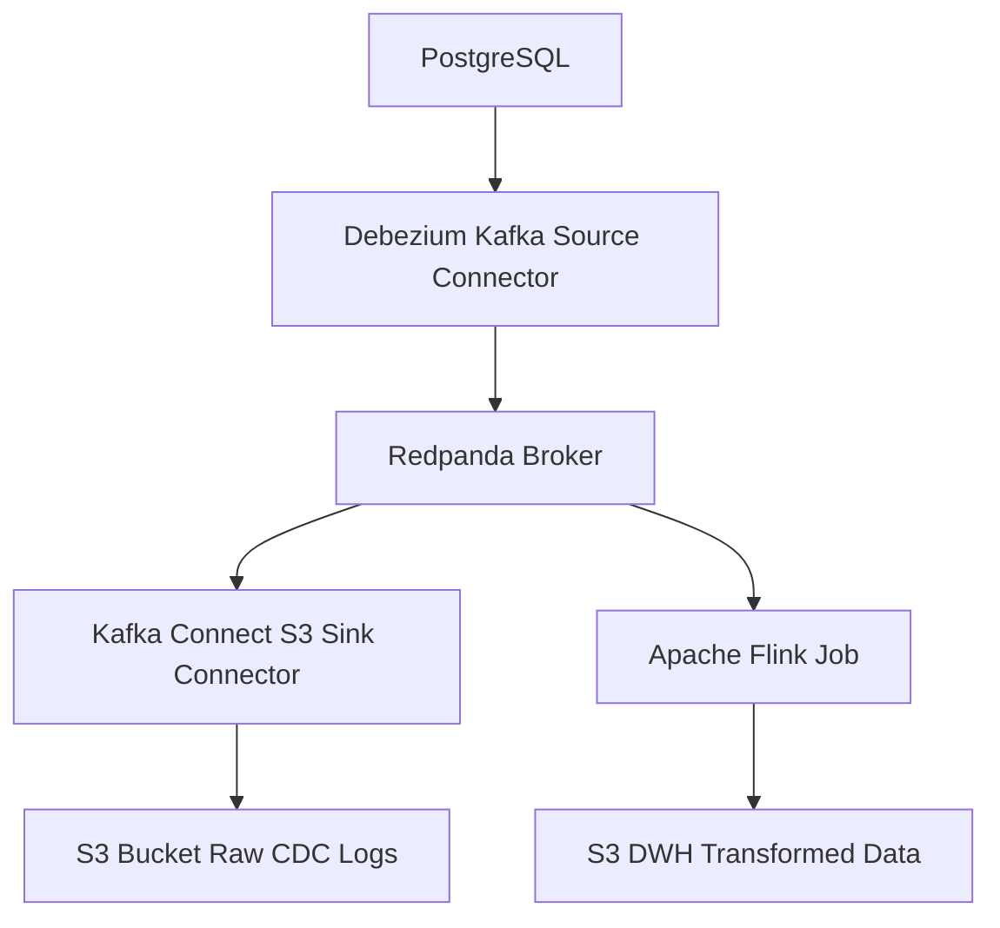

```mermaid
flowchart TD
    A[PostgreSQL] --> B[Debezium Kafka Source Connector]
    B --> C[Redpanda Broker]

    %% Branch 1: Kafka Connect S3 Sink
    C --> D1[Kafka Connect S3 Sink Connector]
    D1 --> E1[S3 Bucket Raw CDC Logs]

    %% Branch 2: Apache Flink Stream ETL
    C --> D2[Apache Flink Job]
    D2 --> E2[S3 DWH Transformed Data]
```