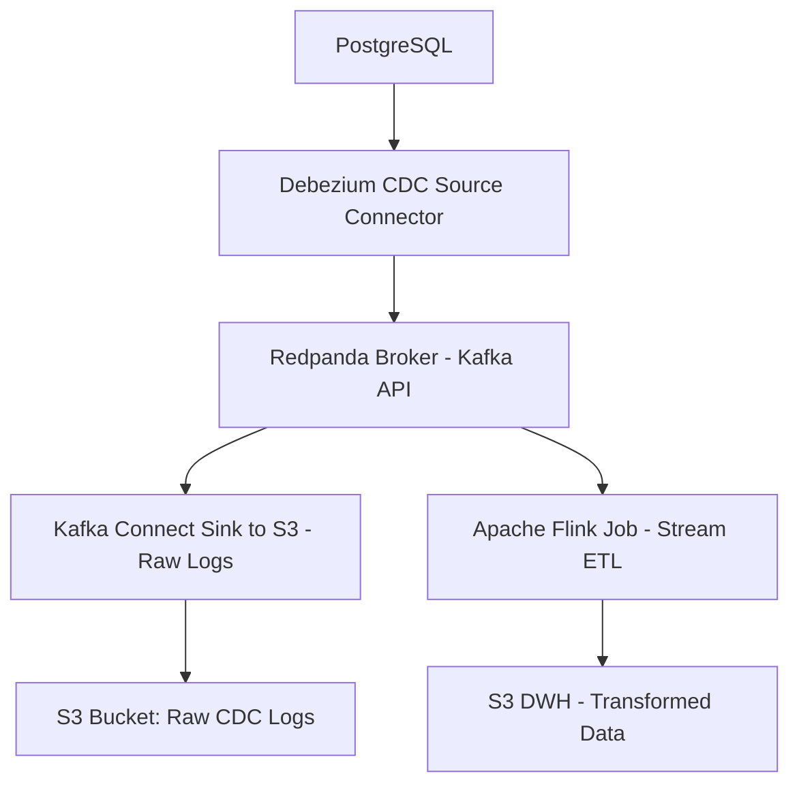

# Building a Modern Data Platform on Kubernetes with Helm: Multi-Environment Deployment from CDC to Real-time ETL

## I. Architecture Overview

The modern data platform architecture presented demonstrates a comprehensive real-time data processing pipeline that captures database changes, processes them through streaming analytics, and archives data for long-term storage. This architecture leverages cloud-native technologies to deliver robust, scalable data operations.



### Component Technical Roles and Communication

**PostgreSQL** serves as the operational source database, configured with logical replication enabled[1][2]. The database writes change events to its Write-Ahead Log (WAL) using the `pgoutput` logical decoding plugin, which is the standard plugin available in PostgreSQL 10+[3][4].

**Debezium CDC Source Connector** functions as a change data capture engine that reads PostgreSQL's logical replication stream[1][5]. The connector establishes a replication slot connection to PostgreSQL, consuming WAL records and transforming them into structured change events. Communication occurs through PostgreSQL's logical replication protocol using the `pgoutput` plugin[4][6].

**Redpanda Broker** provides Kafka API-compatible message streaming[7][8]. Redpanda offers a single-binary architecture that eliminates ZooKeeper dependencies while maintaining full Kafka API compatibility[9][10]. The broker receives change events from Debezium and distributes them to downstream consumers through topic partitions.

**Kafka Connect S3 Sink** consumes raw CDC events from Redpanda topics and archives them to object storage[11][12]. The connector batches events based on configurable flush sizes and time intervals, ensuring exactly-once delivery semantics for long-term data retention[13][14].

**Apache Flink Stream ETL** processes change events in real-time, applying transformations, aggregations, and enrichments[15][16]. Flink jobs consume from Redpanda topics, maintain stateful computations using checkpoints, and output processed data to the data warehouse layer in S3[17][18].

## II. Helm-based Multi-Environment Deployment Design

### 1. Directory & Namespace Strategy

The deployment strategy leverages **Helm umbrella charts** to orchestrate all platform components as manageable subcharts. Each environment operates within dedicated namespaces, providing isolation and independent resource management. Namespace allocation follows the pattern `data-platform-{environment}` where environments include dev, staging, and prod.

```
data-engineering-platform/
├── Chart.yaml
├── values.yaml
├── values-dev.yaml       # Uses namespace: data-platform-dev
├── values-prod.yaml      # Uses namespace: data-platform-prod
├── templates/
│   ├── namespace.yaml    # Dynamically creates namespace per env
├── charts/
│   ├── redpanda/
│   ├── debezium/
│   ├── kafka-connect/
│   ├── flink/
└── scripts/
    ├── create-secrets.sh
    └── deploy.sh
```

**Helm deployment per environment:**
```bash
helm upgrade --install "$RELEASE_NAME" . \
  -f "$VALUES_FILE" \
  -n "$NAMESPACE" --create-namespace
```

for example:
```bash
helm upgrade --install data-platform . \
  -f values-dev.yaml \
  -n data-platform-dev --create-namespace
```

This approach ensures complete environment separation while maintaining consistent deployment patterns across all stages of the data pipeline lifecycle[19][20].

### 2. Secret Management (Manual & Secure)

Security-sensitive credentials remain external to Helm charts, following the principle of least privilege and secrets separation. The platform requires manual secret provisioning through `kubectl` or automated secret creation scripts that execute prior to Helm deployments.

**Example `values.yaml` configuration:**

```yaml
global:
  s3:
    credentialsSecretRef: s3-credentials
  postgres:
    credentialsSecretRef: postgres-credentials
```

**Secret reference in deployment templates:**

```yaml
env:
- name: AWS_ACCESS_KEY_ID
  valueFrom:
    secretKeyRef:
      name: {{ .Values.global.s3.credentialsSecretRef }}
      key: accessKey
```

**Secret creation script (`create-secrets.sh`):**

```bash
kubectl create secret generic s3-credentials \
  --from-literal=accessKey=${AWS_ACCESS_KEY_ID} \
  --from-literal=secretKey=${AWS_SECRET_ACCESS_KEY} \
  -n data-platform-dev

kubectl create secret generic postgres-credentials \
  --from-literal=username=${POSTGRES_USER} \
  --from-literal=password=${POSTGRES_PASSWORD} \
  -n data-platform-dev
```

This manual approach provides explicit control over credential lifecycle and prevents accidental exposure in version control systems. For production roadmap considerations, integration with external secret management solutions like HashiCorp Vault or AWS Secrets Manager can be implemented through the External Secrets Operator.

### 3. Critical Component Configs

Each subchart requires specific configuration tuning to ensure reliable data processing, fault tolerance, and optimal performance across the streaming pipeline.

**Debezium PostgreSQL Connector Configuration:**

```yaml
debezium:
  connector:
    config:
      plugin.name: pgoutput
      table.include.list: {{ .Values.debezium.tableIncludeList }}
      publication.autocreate.mode: filtered
      slot.name: {{ .Values.debezium.slotName }}
      database.server.name: {{ .Values.debezium.databaseServerName }}
      snapshot.mode: initial
      database.hostname: {{ .Values.postgres.host }}
      database.port: {{ .Values.postgres.port }}
      database.dbname: {{ .Values.postgres.dbname }}
    env:
    - name: POSTGRES_USER
      valueFrom:
        secretKeyRef:
          name: {{ .Values.global.postgres.credentialsSecretRef }}
          key: username
    - name: POSTGRES_PASSWORD
      valueFrom:
        secretKeyRef:
          name: {{ .Values.global.postgres.credentialsSecretRef }}
          key: password
```

**Values configuration (`values.yaml`):**

```yaml
debezium:
  tableIncludeList: "public.orders,public.customers"
  slotName: "debezium_slot"
  databaseServerName: "postgres-cdc"

postgres:
  host: "postgres-service"
  port: "5432"
  dbname: "app_database"
```

**Key justifications:**
- `plugin.name: pgoutput` - Uses PostgreSQL's native logical decoding plugin, avoiding external dependencies[3][4]
- `table.include.list` - Limits CDC scope to specific tables, reducing resource consumption
- `publication.autocreate.mode: filtered` - Automatically creates publications for specified tables, ensuring proper logical replication setup[4][6]
- `snapshot.mode: initial` - Captures existing data before streaming changes, ensuring data completeness

**Kafka Connect S3 Sink Configuration:**

```yaml
kafkaConnect:
  connector:
    config:
      flush.size: {{ .Values.kafkaConnect.flushSize }}
      rotate.interval.ms: {{ .Values.kafkaConnect.rotateIntervalMs }}
      s3.part.size: {{ .Values.kafkaConnect.s3PartSize }}
      format.class: io.confluent.connect.s3.format.parquet.ParquetFormat
      partitioner.class: io.confluent.connect.storage.partitioner.TimeBasedPartitioner
      path.format: {{ .Values.kafkaConnect.pathFormat }}
      s3.bucket.name: {{ .Values.s3.bucketName }}
      s3.region: {{ .Values.s3.region }}
      s3.endpoint: {{ .Values.s3.endpoint }}
    env:
    - name: AWS_ACCESS_KEY_ID
      valueFrom:
        secretKeyRef:
          name: {{ .Values.global.s3.credentialsSecretRef }}
          key: accessKey
    - name: AWS_SECRET_ACCESS_KEY
      valueFrom:
        secretKeyRef:
          name: {{ .Values.global.s3.credentialsSecretRef }}
          key: secretKey
```

**Values configuration (`values.yaml`):**

```yaml
kafkaConnect:
  flushSize: 1000
  rotateIntervalMs: 300000
  s3PartSize: 67108864
  pathFormat: "'dt'=YYYY-MM-dd"

s3:
  bucketName: "data-platform-logs"
  region: "us-east-1"
  endpoint: "https://s3.amazonaws.com"
```

**Performance rationale:**
- `flush.size: 1000` - Balances file size with latency, preventing small file proliferation[21][13]
- `rotate.interval.ms: 300000` - 5-minute rotation ensures timely data availability
- `s3.part.size: 67108864` - 64MB parts optimize S3 transfer performance
- Parquet format provides columnar compression and query performance benefits
- Time-based partitioning enables efficient data lake organization

**Apache Flink Job Configuration:**

```yaml
flink:
  job:
    parallelism: {{ .Values.flink.parallelism }}
    config:
      state.checkpoints.dir: {{ .Values.flink.checkpointDir }}
      execution.checkpointing.interval: {{ .Values.flink.checkpointInterval }}
      state.backend: rocksdb
      state.backend.incremental: true
      restart-strategy: exponential-delay
      restart-strategy.exponential-delay.initial-backoff: {{ .Values.flink.restartInitialBackoff }}
      restart-strategy.exponential-delay.max-backoff: {{ .Values.flink.restartMaxBackoff }}
      s3.endpoint: {{ .Values.s3.endpoint }}
    env:
    - name: AWS_ACCESS_KEY_ID
      valueFrom:
        secretKeyRef:
          name: {{ .Values.global.s3.credentialsSecretRef }}
          key: accessKey
    - name: AWS_SECRET_ACCESS_KEY
      valueFrom:
        secretKeyRef:
          name: {{ .Values.global.s3.credentialsSecretRef }}
          key: secretKey
```

**Values configuration (`values.yaml`):**

```yaml
flink:
  parallelism: 4
  checkpointDir: "s3://data-platform-checkpoints/flink"
  checkpointInterval: 60000
  restartInitialBackoff: "10s"
  restartMaxBackoff: "2min"

s3:
  endpoint: "https://s3.amazonaws.com"
```

**Reliability considerations:**
- `parallelism: 4` - Provides processing capacity while avoiding over-parallelization[22][23]
- `state.checkpoints.dir: s3://...` - Enables fault-tolerant state recovery using S3 persistence[17][24][18]
- `execution.checkpointing.interval: 60000` - 1-minute checkpointing balances recovery time with overhead
- `state.backend: rocksdb` with `incremental: true` - Optimizes large state handling with incremental checkpointing[25][26]
- Exponential backoff restart strategy prevents cascading failures during transient issues

**Redpanda Cluster Configuration:**

```yaml
redpanda:
  cluster:
    configuration:
      kafka_api:
        advertised_addresses: 
          - {{ .Values.redpanda.advertisedAddresses.redpanda0 }}:{{ .Values.redpanda.port }}
          - {{ .Values.redpanda.advertisedAddresses.redpanda1 }}:{{ .Values.redpanda.port }}
          - {{ .Values.redpanda.advertisedAddresses.redpanda2 }}:{{ .Values.redpanda.port }}
      group_initial_rebalance_delay: {{ .Values.redpanda.rebalanceDelay }}
      log_retention_ms: {{ .Values.redpanda.logRetentionMs }}
      log_segment_size: {{ .Values.redpanda.logSegmentSize }}
```

**Values configuration (`values.yaml`):**

```yaml
redpanda:
  port: 9092
  rebalanceDelay: 3000
  logRetentionMs: 604800000
  logSegmentSize: 134217728
  advertisedAddresses:
    redpanda0: "redpanda-0.redpanda-headless.data-platform-dev.svc.cluster.local"
    redpanda1: "redpanda-1.redpanda-headless.data-platform-dev.svc.cluster.local"
    redpanda2: "redpanda-2.redpanda-headless.data-platform-dev.svc.cluster.local"
```

**Operational benefits:**
- Proper advertised addresses ensure client connectivity within Kubernetes clusters[7][27]
- `group_initial_rebalance_delay: 3000` - Allows consumer groups to stabilize before rebalancing
- `log_retention_ms: 604800000` - 7-day retention provides adequate replay capability
- `log_segment_size: 134217728` - 128MB segments optimize disk I/O and compaction performance

## III. Future Enhancements

### Monitoring

**Prometheus + Grafana Integration:**

Enhance observability by deploying Prometheus for metrics collection and Grafana for visualization. Key integrations include:

- **Redpanda metrics**: Expose JMX metrics via Prometheus endpoints for broker health, partition metrics, and consumer lag[9]
- **Kafka Connect metrics**: Monitor connector throughput, error rates, and task status
- **Flink metrics**: Track job performance, checkpoint durations, and backpressure indicators[15]
- **Custom business metrics**: Application-specific KPIs like records processed per minute and data freshness

### Schema Management

**Confluent Schema Registry Integration:**

Implement schema evolution management through Schema Registry[28][29][30]:

```yaml
schemaRegistry:
  enabled: true
  url: http://schema-registry:8081
  auth:
    enabled: true
    credentialsSecret: schema-registry-auth
```

Schema Registry provides:
- **Centralized schema storage** for Avro, JSON, and Protobuf formats[31][32]
- **Compatibility checks** during schema evolution to prevent breaking changes[30]
- **Version management** enabling backward and forward compatibility[29]
- **Integration with Kafka Connect** for automatic schema registration and validation[31]

### Data Governance

**OpenMetadata Integration:**

Deploy OpenMetadata for comprehensive data cataloging and lineage tracking[33][34]:

- **Metadata ingestion** from all data platform components
- **Column-level lineage** from source databases through transformations to data warehouse
- **Data quality monitoring** with automated profiling and anomaly detection
- **Collaborative workflows** for data stewardship and governance

**DataHub Alternative:**

DataHub provides similar capabilities with stronger GraphQL APIs and microservices architecture[35][36][37]:

- **Real-time metadata updates** through stream-oriented infrastructure
- **Actions framework** for automated governance workflows
- **Impact analysis** for schema changes across the data pipeline
- **Fine-grained access controls** for data asset management

### New Connectors

**Multi-Database CDC Expansion:**

Extend Debezium capabilities to additional database systems[1][5]:

- **MySQL connector** for e-commerce transaction data
- **MongoDB connector** for document-based content management
- **Oracle connector** for legacy enterprise systems

**Enhanced Sink Connectors:**

Add specialized sink connectors for analytical workloads[38][13]:

- **ClickHouse sink** for real-time analytics and OLAP queries
- **Snowflake sink** for cloud data warehouse integration
- **BigQuery sink** for Google Cloud analytics workflows

These connectors enable broader data ecosystem integration while maintaining the platform's real-time processing capabilities.

## References

### Change Data Capture (CDC) & Debezium

[1] Debezium connector for PostgreSQL. *Debezium Documentation*. https://debezium.io/documentation/reference/stable/connectors/postgresql.html

[2] Debezium Architecture. *Debezium Documentation*. https://debezium.io/documentation/reference/stable/architecture.html

[3] Installing Debezium. *Debezium Documentation*. https://debezium.io/documentation/reference/stable/install.html

[4] Track every PostgreSQL data change using Debezium. *Dev.to*. https://dev.to/emtiajium/track-every-postgresql-data-change-using-debezium-5e19

[5] Debezium could not access file "decoderbufs" using postgres 11 with default plugin pgoutput. *Stack Overflow*. https://stackoverflow.com/questions/59978213/debezium-could-not-access-file-decoderbufs-using-postgres-11-with-default-plug

[6] Using PostgreSQL pgoutput Plugin for Change Data Capture With Debezium. *DZone*. https://dzone.com/articles/using-postgresql-pgoutput-plugin-for-change-data-c

[7] Using PostgreSQL pgoutput plugin for change data capture with Debezium on Azure. *Dev.to*. https://dev.to/azure/using-postgresql-pgoutput-plugin-for-change-data-capture-with-debezium-on-azure-26jp

### Streaming & Message Brokers

[8] Kafka Compatibility. *Redpanda Documentation*. https://docs.redpanda.com/current/develop/kafka-clients/

[9] Redpanda vs. Kafka. *Redpanda*. https://www.redpanda.com/compare/redpanda-vs-kafka

[10] Apache Kafka vs. Redpanda - Confluent. *Confluent*. https://www.confluent.io/redpanda-vs-kafka-vs-confluent/

[11] Apache Kafka Limitations - Redpanda. *Redpanda*. https://www.redpanda.com/guides/kafka-alternatives-kafka-limitations

[12] Kafka API - Types, use cases and compatible solutions - Redpanda. *Redpanda*. https://www.redpanda.com/guides/kafka-alternatives-kafka-api

### Data Storage & S3 Connectors

[13] Kafka Connect Amazon S3 Sink Connector. *Confluent Documentation*. https://docs.confluent.io/legacy/platform/5.2.4/connect/kafka-connect-s3/index.html

[14] Amazon S3 Sink Connector for Confluent Platform. *Confluent Documentation*. https://docs.confluent.io/kafka-connectors/s3-sink/current/overview.html

[15] Configuration Reference for Amazon S3 Sink Connector for Confluent Platform. *Confluent Documentation*. https://docs.confluent.io/kafka-connectors/s3-sink/current/configuration_options.html

[16] S3 Connector. *Confluent Documentation*. https://docs.huihoo.com/apache/kafka/confluent/4.0/connect/connect-storage-cloud/kafka-connect-s3/docs/s3_connector.html

[17] Connect Kafka to AWS S3 - Lenses.io. *Lenses.io*. https://lenses.io/kafka-connectors/kafka-to-aws-s3-old/

[18] Is there a way in the S3 Kafka sink connector to ensure all records are consumed. *Stack Overflow*. https://stackoverflow.com/questions/65663750/is-there-a-way-in-the-s3-kafka-sink-connector-to-ensure-all-records-are-consumed

### Apache Flink & Stream Processing

[19] Apache Flink and Kubernetes: A Perfect Match for Cloud-Native Data Processing. *Ace the Cloud Blog*. https://blog.acethecloud.com/apache-flink-and-kubernetes-a-perfect-match-for-cloud-native-data-processing-10-recipes-6b15a132b186

[20] Get Running with Apache Flink on Kubernetes, part 2 of 2. *Decodable Blog*. https://www.decodable.co/blog/get-running-with-apache-flink-on-kubernetes-2

[21] Native Kubernetes. *Apache Flink Documentation*. https://nightlies.apache.org/flink/flink-docs-release-2.0/docs/deployment/resource-providers/native_kubernetes/

[22] Kubernetes. *Apache Flink Documentation*. https://nightlies.apache.org/flink/flink-docs-master/docs/deployment/resource-providers/standalone/kubernetes/

[23] Enable checkpointing to S3 - Flink Jobs. *Confluent Documentation*. https://docs.confluent.io/platform/current/flink/flink-jobs/checkpoint-s3.html

[24] Writing Flink checkpoints to S3. *Stack Overflow*. https://stackoverflow.com/questions/79258734/writing-flink-checkpoints-to-s3

[25] Apache Flink to use S3 for backend state and checkpoints. *Stack Overflow*. https://stackoverflow.com/questions/64226597/apache-flink-to-use-s3-for-backend-state-and-checkpoints/64226598

[26] Checkpoints - Managed Service for Apache Flink. *AWS Documentation*. https://docs.aws.amazon.com/managed-flink/latest/java/troubleshooting-checkpoints.html

[27] Parallel Execution. *Apache Flink Documentation*. https://nightlies.apache.org/flink/flink-docs-master/docs/dev/datastream/execution/parallel/

### Schema Management & Data Governance

[28] Integrate Confluent Schema Registry with Kafka Connector - Example. *MuleSoft Documentation*. https://docs.mulesoft.com/kafka-connector/latest/kafka-connector-configure-confluent-example

[29] Schema Registry for Confluent Platform. *Confluent Documentation*. https://docs.confluent.io/platform/current/schema-registry/index.html

[30] Confluent Schema Registry: Enforcing Data Contracts in Kafka. *Confluent Developer*. https://developer.confluent.io/courses/apache-kafka/schema-registry/

[31] Confluent Schema Registry for Kafka. *GitHub*. https://github.com/confluentinc/schema-registry

[32] Integrate Schemas from Kafka Connect in Confluent Platform. *Confluent Documentation*. https://docs.confluent.io/platform/current/schema-registry/connect.html

[33] Data Governance. *OpenMetadata Documentation*. https://docs.open-metadata.org/latest/how-to-guides/data-governance

[34] OpenMetadata GitHub Repository. *GitHub*. https://github.com/open-metadata/OpenMetadata

[35] Top Open Source Database Governance Tools in 2025. *Bytebase Blog*. https://www.bytebase.com/blog/top-open-source-database-governance-tools/

[36] Act on Metadata Overview. *DataHub Documentation*. https://datahubproject.io/docs/0.15.0/act-on-metadata/

[37] Metadata Standards. *DataHub Documentation*. https://datahubproject.io/docs/metadata-standards/

[38] Act on Metadata Overview. *DataHub Documentation*. https://datahubproject.io/docs/0.15.0/act-on-metadata/

